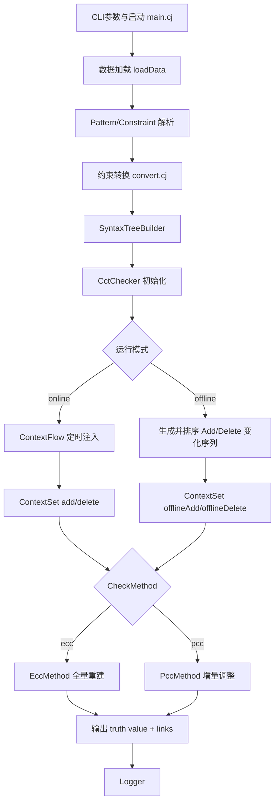
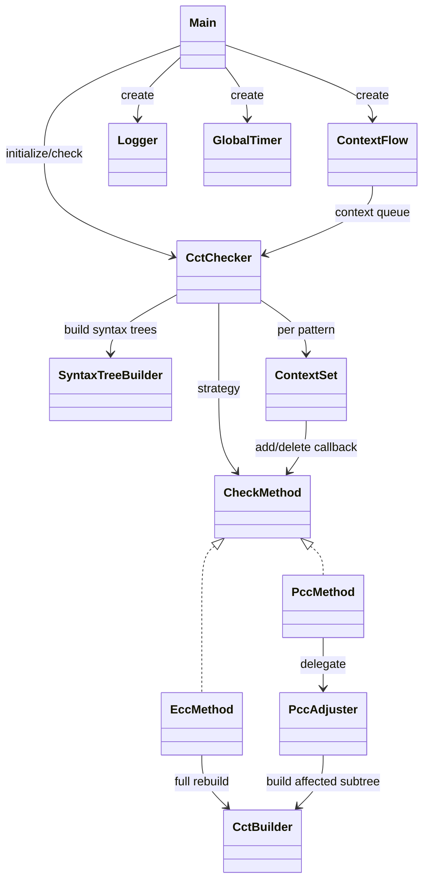
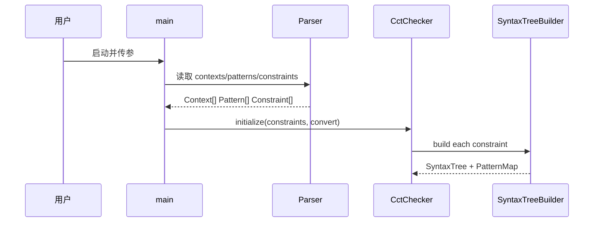
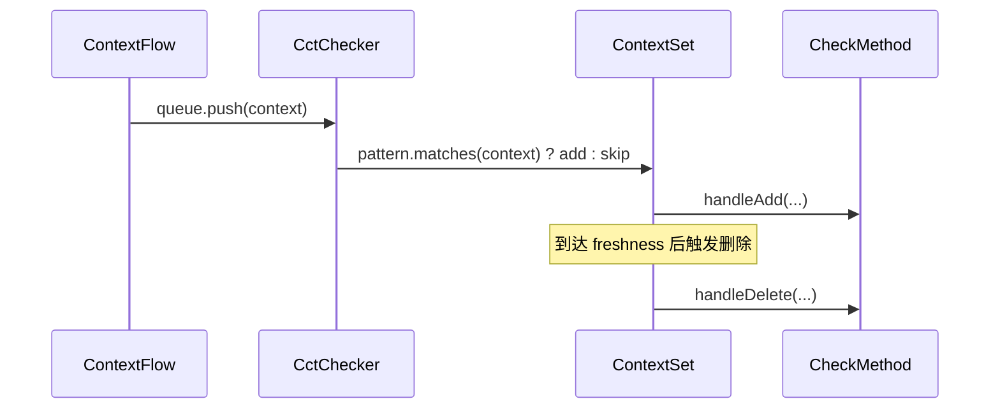

# pcc_cangjie 系统架构说明

本文档介绍项目整体架构、核心设计、模块间关联方式，以及 ECC/PCC 两种检查路径的实现差异。

## 0. 与论文细节差异

- 允许单个约束定义时出现同名 pattern 和同名变量名，bfunc 中的变量声明会以最近的量词绑定为准（即 shadowing 规则），这在实际使用中更灵活
- 单个上下文匹配了多个 pattern 时，每个 pattern 会以约束为最小单位触发 handleAdd/handleDelete，由上一条可知，这有可能包含多个语法树节点。
  - 对于 ECC 来说，不论节点数量多少，都是直接重建整棵树；对于 PCC 来说，则会分别针对每个节点进行增量构建与调整。这样的实现避免了不必要的 ECC 过程，更符合实际情况。
  - 由于检查流程都包含构建过程，构建时会访问上下文集合的状态，所以以约束为单位，而非影响节点为单位，触发 handleAdd/handleDelete，可以保证在构建过程中上下文集合状态的一致性，同时需要在上下文添加或删除的时候加锁，保证同时只有一个线程在修改上下文集合并检查。
  - 由于在上下文变化时会实时进行约束检查，有可能在某次检查后上下文就过期了，在添加时要记录影响了几个约束，以便在过期删除时正确触发相同次数的 handleDelete
- 没有把真值评估和链接生成完全拆分成两个独立过程，而是合并在同一遍历点触发。使用类似 Walker + Listener 设计模式而非 Visitor 设计模式。使“真值 + 链接”同步更新，避免了两次遍历带来的性能损失
- PccListener 复用 EccListener，只有添加上下文使用了不同逻辑

## -1. 未选择的设计

- 统计同一上下文添加影响了多少个约束，删除时触发相同数量的 handleDelete（针对 ECC）
  - 上下文集合自身在设计上可能有不同的过期时间，删除时同样可能会重复计算 handleDelete，而且与 PCC 比较时不方便确定实现正确性
- 以影响节点为单位触发 handleAdd/handleDelete
  - 可能导致同一上下文集合中的上下文添加或删除在同一约束上触发多次 ECC，明显这是拉偏架了（虽然实际约束中很少有同名 pattern 的情况，应该不影响论文结果）
- 使用完全逻辑时钟，把事件放在逻辑时间轴上，同一时刻的事件“同时”处理
  - 不方便控制过期，如果下一个上下文不到来，时钟就不会走了，过期机制就失效了
  - 使用了模拟时钟，起始时间默认为第一条上下文的时间戳，以真实流逝时间为基础，提供 now() 接口，既保证了时间的单调递增，又不依赖于上下文的到来，过期机制也能正常工作

## 1. 设计目标

系统目标是对上下文事件流进行在线约束检查，核心要求包括：

- 支持声明式约束表达（量词 + 逻辑连接 + 自定义布尔函数）
- 支持上下文添加与过期删除
- 支持在线/离线两种运行形态（实时注入与离线回放）
- 支持不同检查策略（ECC与PCC）
- 支持可配置的数据输入、新鲜度需求和日志输出位置

## 2. 总体架构

系统按职责可分为 8 个层次：

1. 启动与编排层
2. 数据输入与解析层
3. 上下文模型层
4. 语法树构建与转换层
5. 检查执行层（ECC/PCC）
6. 上下文流层
7. 全局时钟与日志层
8. 用户自定义BFunc层



## 3. 分层与模块职责

### 3.1 启动与编排层

- 入口：[src/main.cj](src/main.cj)
- 主要职责：
- 解析运行参数（如 data、convert、method、freshness、interval）
- 创建日志器和全局时钟，设置全局 freshness
- 加载输入数据并初始化 CctChecker
- 启动 ContextFlow，驱动在线检查

运行主线可概括为：

1. parseArgs
2. loadData
3. CctChecker.initialize
4. 开启时钟、日志器
5. ContextFlow + CctChecker.check
6. 日志关闭

### 3.2 数据输入与解析层

- XML 词法/语法解析：[src/parse/xml.cj](src/parse/xml.cj)
- Pattern 解析：[src/parse/pattern.cj](src/parse/pattern.cj)
- Constraint/Formula 解析：[src/parse/constraint.cj](src/parse/constraint.cj)
- 时间与 lifespan 解析：[src/parse/time.cj](src/parse/time.cj)

该层将外部文本/XML 转为内部对象：

- contexts.txt -> Context
- patterns.xml -> Pattern
- constraints.xml -> Constraint(Formula)

### 3.3 领域模型层

- 上下文与变化类型：[src/defs/context.cj](src/defs/context.cj)
- 约束公式：[src/defs/constraint.cj](src/defs/constraint.cj)
- 模式匹配：[src/defs/pattern.cj](src/defs/pattern.cj)
- 共享 freshness 全局量：[src/defs/common.cj](src/defs/common.cj)

这里定义了系统语义基础：

- Formula 是约束抽象语法（Forall/Exists/And/Or/Implies/Not/Bfunc）
- Pattern.matches 决定事件是否进入某个模式上下文集
- ContextChangeType（Add/Delete）用于驱动增量更新

### 3.4 语法树构建与转换层

- 公式转换：[src/check/convert.cj](src/check/convert.cj)
- 语法树定义与构建：[src/check/syntax_tree.cj](src/check/syntax_tree.cj)

关键设计：

- `convert` 决定约束正规化方式：
- kernel：将 Exists/Or/Implies 转换为 Forall/And/Not/Bfunc 核心算子
- notleaf：推动 Not 下沉到叶子附近，减少中间层否定传播
- none：保持原公式结构

SyntaxTreeBuilder 在构建时同时维护：

- dfn 编号与节点索引
- 变量名到 dfn 的绑定
- PatternMap：patternId -> constraintId -> [quantifierNodeDfn...]

其中 PatternMap 是“事件匹配后定位受影响语法树节点”的关键索引。

### 3.5 检查执行层

- 调度器与全局状态：[src/check/cct_checker.cj](src/check/cct_checker.cj)
- CCT 结构与构建器：[src/check/cct.cj](src/check/cct.cj)
- Listener 框架：[src/check/listener.cj](src/check/listener.cj)
- ECC 路径：[src/check/ecc.cj](src/check/ecc.cj)
- PCC 路径：[src/check/pcc.cj](src/check/pcc.cj)
- 上下文集与过期机制：[src/check/context_set.cj](src/check/context_set.cj)

这一层是系统核心。

其中 CctBuilder 是 ECC 与 PCC 的共同构建内核：

- 负责把 SyntaxTreeNode 映射为运行期 CctNode
- 在构建过程中触发 Listener（Evaluator + Generator），同步产出 truthValue 与 links
- 负责量词节点的上下文展开（ctx2child）和赋值链（assignments）拼接

#### CctChecker 的核心状态

- CCTs：每个约束对应一棵运行期检查树
- ContextSets：每个 Pattern 一组上下文与计数
- PatternMap：由语法树构建阶段生成，驱动精准更新
- method：当前策略（ECC 或 PCC）

#### Listener 模式

设计上将节点处理拆分为两类职责：

- Evaluator：计算 truthValue
- Generator：计算 links（满足/违反）

CheckListener 将二者组合，在同一遍历点统一触发，保证“真值 + 证据”同步更新。

### 3.6 流与时钟层

- 事件流注入：[src/collection/context_flow.cj](src/collection/context_flow.cj)

关键机制：

- ContextFlow 使用定时器按 interval 将上下文推入阻塞队列
- 末尾推入 POISON_CONTEXT 作为结束信号

### 3.7 全局时钟与日志层

- 模拟时间：[src/timing/mock.cj](src/timing/mock.cj)
- 日志：[src/logger/logger.cj](src/logger/logger.cj)

关键设计：

- MockTimer 以“起始时间 + 真实流逝时长”提供统一 now()

### 3.8 用户自定义BFunc层

- 自定义 BFunc：[src/user/user_bfunc.cj](src/user/user_bfunc.cj)
- BFunc 反射调用：[src/check/bfunc.cj](src/check/bfunc.cj)

## 4. 模块关联关系



## 5. 关键执行时序

### 5.1 初始化阶段



### 5.2 运行阶段（通用）



  ### 5.3 离线运行阶段（新增）

  ```mermaid
  sequenceDiagram
    participant M as main
    participant CK as CctChecker
    participant CS as ContextSet
    participant CM as CheckMethod

    M->>CK: check(contexts:Array<Context>, method)
    CK->>CK: 为每个匹配生成 Add/Delete 变化项
    CK->>CK: 按时间戳稳定排序
    loop 按序处理变化项
      CK->>CS: offlineAdd / offlineDelete
      CS->>CM: handleAdd / handleDelete
    end
  ```

  离线模式关键点：

  - 不依赖 `ContextFlow` 和 `Timer.once`，而是一次性生成变化序列后按时间顺序回放
  - `freshness` 由各 Pattern 的 freshness 字段决定删除时间（Add 时间 + Pattern freshness）
  - 同样复用 ECC/PCC 两套检查逻辑，差异仅在上下文变化的驱动方式

  ### 5.4 ECC 与 PCC 差异

#### ECC（[src/check/ecc.cj](src/check/ecc.cj)）

- 在 add/delete 时直接调用 CctBuilder，从语法树根重建整棵 CCT
- 重建时会完整执行一遍 Listener，重新计算所有相关节点 truthValue 与 links
- 逻辑简单，结果一致性直接
- 每次变化成本较高

#### PCC（[src/check/pcc.cj](src/check/pcc.cj)）

- 由 PccMethod 委托 PccAdjuster 执行增量调整
- 根据受影响量词节点 dfn 计算 affected 路径，仅更新“该节点到根”的必要部分
- add 时调用 CctBuilder 仅构建“新上下文对应的量词体子树”，再并入 ctx2child
- delete 时不重建子树，直接移除 ctx2child 后向上重算聚合节点

### 5.5 CctBuilder 与 ECC/PCC 的协作机制

这一节从“调用时机、构建粒度、状态写入”三个角度说明二者关系。

#### 5.5.1 调用时机

- ECC：每次 handleAdd/handleDelete 都调用 `cctBuilder.build(cct.syntaxTree.root)`
- PCC（冷启动）：当 `cct.root` 为空时，仍调用 `cctBuilder.build(cct.syntaxTree.root)`
- PCC（增量 add）：调用 `cctBuilder.build(node.syntaxTreeNode.children[0], parent: node, ctx: context)`

#### 5.5.2 构建粒度

- ECC：全量构建
- ECC 输入是根节点，输出是完整新根，旧 root 被整体替换

- PCC：局部构建
- PCC 输入是受影响量词节点的 body（不是根）
- PCC 输出是该量词的一个新 child 分支
- 新分支写入 `QuantifierNode.ctx2child[contextId]`

#### 5.5.3 状态写入与重算范围

- ECC：CctBuilder 直接产出完整树状态，Logger 记录“全树重算后”的结果快照

- PCC：CctBuilder 只负责“新增那一支”的节点状态
- PCC：祖先节点通过 adjustHelper 向上触发 Listener 做聚合重算

#### 5.5.4 两种路径的伪代码对照

ECC：

```txt
onChange(cct):
    cct.root = cctBuilder.build(cct.syntaxTree.root)
    log(cct.result)
```

PCC（Add）：

```txt
onAdd(cct, nodeId, context):
    if cct.root is None:
        cct.root = cctBuilder.build(cct.syntaxTree.root)
    else:
        mark affected path(nodeId -> root)
        newChild = cctBuilder.build(bodyOf(nodeId), parent=nodeId, ctx=context)
        attach newChild to quantifier.ctx2child
        recompute only affected ancestors via listener
    log(cct.result)
```

PCC（Delete）：

```txt
onDelete(cct, nodeId, contextId):
    mark affected path(nodeId -> root)
    remove quantifier.ctx2child[contextId]
    recompute only affected ancestors via listener
    log(cct.result)
```

## 6. 数据结构设计要点

### 6.1 PatternMap：精准路由更新

PatternMap 结构为：

- key: patternId
- value: map(constraintId -> list(quantifierNodeDfn))

作用：当某个 pattern 命中新 context 时，系统无需扫描整棵树，可直接定位需要 handleAdd/handleDelete 的量词节点。

### 6.2 CCT 节点与赋值链

- CctNode 保存 truthValue 与 links
- 量词节点维护 ctx2child，非量词节点维护 children 列表
- AssignmentLinkedListNode 保存变量绑定链，用于 bfunc 参数取值与证据输出

### 6.3 Links 组合代数

- union：并集
- product：笛卡尔组合
- flipset：Satisfied/Violated 反转

对应实现位于 [src/collection/linked_list.cj](src/collection/linked_list.cj)。

## 7. 并发与一致性

核心同步点在 [src/check/context_set.cj](src/check/context_set.cj)：

- add/delete 都在 checker.mutex 保护下修改共享状态
- 通过 addChangeNum/deleteChangeNum 计数配合 condition 通知
- 主循环收到 POISON_CONTEXT 后，等待“新增/删除处理数相等”再退出

这保证了在程序结束前，所有已注入的上下文都被正确处理，且日志记录了完整的检查结果。

补充：在线/离线模式在一致性机制上的差异

- 在线模式：由 `ContextFlow + Timer.once` 驱动，依赖互斥锁与条件变量协调 Add/Delete 计数
- 离线模式：单线程顺序处理排序后的变化项，不经过 `Timer.once` 与结束条件等待逻辑

## 8. 可扩展性设计

### 新增 BFunc

1. 在 [src/user/user_bfunc.cj](src/user/user_bfunc.cj) 新增静态函数
2. 在 constraints.xml 中使用同名 bfunc
3. 确保参数顺序与数量匹配

## 9. 一些仓颉编程语言 bug

- std.regex 内的 MatchData 的 groupCount() 是匹配到的最大组 id + 1，而不是正则表达式表示的组数。这是使用的第三方库 pcre2 导致的。[issue #510](https://gitcode.com/Cangjie/cangjie_runtime/issues/510)
  > Offset values that correspond to unused groups at the end of the expression are also set to PCRE2_UNSET. For example, if the string "abc" is matched against the pattern (abc)(x(yz)?)? groups 2 and 3 are not matched. The return from the function is 2, because the highest used capture group number is 1. The offsets for the second and third capture groups (assuming the vector is large enough, of course) are set to PCRE2_UNSET. [pcre2 api](https://pcre2project.github.io/pcre2/doc/pcre2api/)
- 反射部分出现了变长参数语法糖的错误，`Array<Any>` 会把 `Any` 绑定到数组上，导致调用时数组没有展开成多个参数。[issue #812](https://gitcode.com/Cangjie/cangjie_compiler/issues/812)
